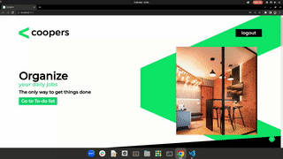

# Coopers - Full Stack Test

## Preview

  

## Installation

### Backend

**Rename .env.example to .env**

```
cd backend
npm install
docker-compose up
```

### Frontend

```
cd frontend
npm install
npm run dev
```

## Report

Considering how the project description was written, I've decided to focus more on the frontend and make the backend the simplest it could possibly be. Feel free to check out this other [project](https://github.com/talesrodriguesDEV/quotes-api) of mine where I tried to apply Clean Architecture principles in a CRUD API.

Frontend was built with React (Vite), Tailwind CSS and TypeScript. I had never built a layout with so much detail and it was very challenging do so, especially with a Responsive Design.

Backend was built with Node, JavaScript, Express, JWT authentication, Mongoose and Docker.

Here's how the app works:

1. User can't access the lists without being logged in. When they are clicked user is redirected to login form.

2. User can then creates an account or log into a previous account, in which case the previous tasks will be loaded.

3. Lists can't have more than 5 tasks. User can add tasks to do, mark them as done, and delete them. Every change is simultaneously updated in the database thorugh the API.
